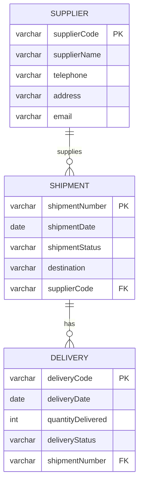

# Supply Chain Management System (SCMS) — Entity Relationship Diagram

**SupplyNet Ltd** — Musanze District, Northern Province, Rwanda

## Entities & Attributes

| Entity   | Primary Key     | Attributes |
|----------|-----------------|------------|
| Supplier | `supplierCode`  | supplierName, telephone, address, email |
| Shipment | `shipmentNumber`| shipmentDate, shipmentStatus, destination |
| Delivery | `deliveryCode`  | deliveryDate, quantityDelivered, deliveryStatus |

## Relationships & Cardinalities

1. **Supplier — Shipment** (1 : N)
   - One supplier can be associated with many shipments.
   - Each shipment is linked to one supplier via `supplierCode` (FK).

2. **Shipment — Delivery** (1 : N)
   - One shipment can have many deliveries.
   - Each delivery is linked to one shipment via `shipmentNumber` (FK).

## ERD Diagram (draw.io / Lucidchart reference)



## Crow's Foot Notation Summary

```
┌─────────────────┐         ┌─────────────────┐         ┌─────────────────┐
│    SUPPLIER     │ 1     * │    SHIPMENT     │ 1     * │    DELIVERY     │
├─────────────────┤─────────├─────────────────┤─────────├─────────────────┤
│ supplierCode PK │         │ shipmentNumber  │         │ deliveryCode PK │
│ supplierName    │         │ shipmentDate    │         │ deliveryDate    │
│ telephone       │         │ shipmentStatus  │         │ quantityDelivered│
│ address         │         │ destination     │         │ deliveryStatus  │
│ email           │         │ supplierCode FK │         │ shipmentNumber FK│
└─────────────────┘         └─────────────────┘         └─────────────────┘
```

## Keys

| Table    | Primary Key      | Foreign Keys                    |
|----------|------------------|---------------------------------|
| Supplier | supplierCode     | —                               |
| Shipment | shipmentNumber   | supplierCode → Supplier         |
| Delivery | deliveryCode     | shipmentNumber → Shipment       |
